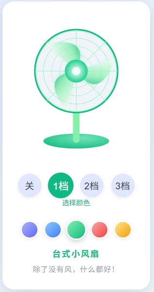

# 台式小风扇 - 可换颜色版

## 项目概述

这是一个使用HTML、CSS和JavaScript实现的台式小风扇模拟器，具有多档位调速和颜色主题切换功能。风扇的外观和动画效果完全使用SVG和CSS实现，无需任何图片资源。

## 功能亮点

- **三档风速**：想快就快，想慢就慢，想停就停（0档关机，静如处子）
- **扇叶旋转动画**：视觉清凉，心理降温
- **一键关机**：省电环保，操作简单
- **外观精美**：色彩丰富，赏心悦目神器
- **颜色主题切换**：提供紫色、蓝色、绿色、红色、黄色五种颜色主题
- **颜色记忆功能**：自动记住用户选择的颜色，下次打开时自动应用

## 技术实现

### 1. SVG绘图

- 使用SVG绘制风扇的各个部件，包括扇叶、中心、底座等
- 使用渐变和滤镜实现光影效果
- 通过CSS类和自定义属性实现颜色主题的动态切换

### 2. 动画效果

- 使用`requestAnimationFrame`实现平滑的扇叶旋转动画
- 根据不同档位设置不同的旋转速度

### 3. 颜色主题系统

- 定义多套颜色主题配置
- 通过JavaScript动态修改SVG元素的颜色属性
- 使用LocalStorage保存用户的颜色偏好

### 4. 响应式设计

- 适配不同屏幕尺寸
- 优化移动端触摸体验

## 使用方法

1. **调整风速**：点击底部的档位按钮（关、1档、2档、3档）
2. **切换颜色**：点击颜色选择器中的颜色按钮
3. **记忆功能**：系统会自动记住您选择的颜色，下次打开时自动应用

## 项目地址

本项目已托管在GitHub上：[https://github.com/HqmJoker/fake-fans](https://github.com/HqmJoker/fake-fans)

在线预览：[https://HqmJoker.github.io/fake-fans/](https://HqmJoker.github.io/fake-fans/)

## 如何贡献

欢迎提交问题和改进建议！如果您想为项目做出贡献，请：

1. Fork本仓库
2. 创建您的特性分支 (`git checkout -b feature/amazing-feature`)
3. 提交您的更改 (`git commit -m '添加了一些很棒的功能'`)
4. 推送到分支 (`git push origin feature/amazing-feature`)
5. 开启一个Pull Request

## 许可证

本项目采用MIT许可证。详情请参阅[LICENSE](LICENSE)文件。

## 作者

- **HqmJoker** - [GitHub主页](https://github.com/HqmJoker)

## 致谢

- 感谢所有对本项目提供反馈和建议的用户
- 灵感来源于现实生活中的台式小风扇